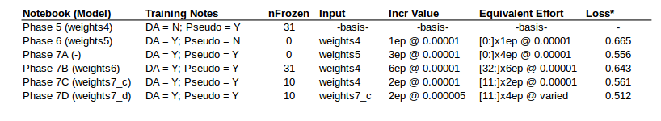

# Distracted-Drivers - a Posture Classification Problem

Subject: Deep learning models for classifying driving as good or 1 of 9 distraction categories. A Kaggle competition. 

## Brief Introduction

For background on the distracted driver problem, data set and related Kaggle competion, please go to https://www.kaggle.com/c/state-farm-distracted-driver-detection   

The distracted driver classification is difficult when the training data set only provides around 50 subjects (disregard the total number of training images for now). Skin tone, hair colour/style and clothing colour/style are hugely variable amongst the test subjects, whilst the variation between posture-detection categories (within-subject) is quite small. I could not visually distinguish or agree with the classification boundary between many of the radio tuning vs and grooming classifications; radio tuning vs reaching behind vs talking to passenger; good driving (when looking to right, presumably at an intersection) vs talking to passenger; and good driving (when looking at rear view mirror) vs makeup.

I have a Master of Science Phil. (Statistics/Quality Engineerng) in which I additionally completed coursework in Advanced Multivariate Statistics, Mathematical Statistics, and Data Mining/Machine Learning. The purpose of this repository is to demonstrate my practical skills in Deep Learning using Python | Numpy | Pandas | Keras | Theano. 

## Comparisons

Two different comparisons were made:
1. Effect of retraining varying numbers of convolutional layers
2. Vgg16 vs Resnet50 vs InceptionV3

## Results

### Effect of retraining varying numbers of convolutional layers

#### Table 1

Table 1 shows the loss* of various models as calculated by data provided by kaggle's submission evaluator.

Freezing the first 10/31 layers and mild retraining of the remaining convolutional layers seemed to produce a lower loss than when all of the convolutional layers were retrained and none of the layers were retrained.

* Loss (calculated as weighted average) = 0.31x(Kaggle Public Leaderboard Loss) + 0.69*(Kaggle Private Leaderboard Loss).  

### Vgg16 vs Resnet50 vs InceptionV3

Vgg16 seemed to be the best of the three pretrained models that were adapted to distracted driver classification.  Vgg16 is a comparitively large model containing a lot of features.  It is said to be better for transfer learning than Resnet and Inception. See notebooks for details.

## Discussion

The comparison is slighly flawed as the case in which 10 layers were frozen, and the rest were retrained, the learning rate was set at 0.00001 for 2 epochs (saved as weights7_vgg16final_c) followed by a step down in the learning to 0.000005 for another 2 epochs.  Both other cases, all convolutional layers retrained (Phase 7A) and all convolutional layers retained (Phase 7B) were left with a training rate of 0.00001 which would have lead to slighly more overfitting and less general models. Phase 7A results (retraining of all layers) also missed out on the benefit of pseudo labeled training data for the first of 4 epochs, though this would have been diluted by the subsequent 3 epochs of training. To make completely fair comparions, the experiment should be repeated with a standardised method.  

Regardless, the best model produced involved annealing of the upper 2/3rds of the convolution model (Phase 7D: weights7_vgg16final_d.h5). This model achieved a cross-entropy loss of [0.493,0.54] (private, public leaderboard losses) when graded by the Kaggle.com website which places the result in the top quartile of final results on the public leader board (somewhere between [21.9%,23.9%]).

## Conclusions

The best model (Phase 7d) achieved a top quartile performance in the State Farm distracted driver classification problem as measure by kaggle.com's loss evaluator and their final public leader board results. This good result was achieved using only resources/methods that were available in 2015, including:
- Transfer learning from Vgg16 convolutional layers
- Lightweight hidden dense layers (128 filters + 128 filters) with batch normalisation to improve convergence spd
- Using data augmentation (no dropout) and high quality pseudo labeling data to prevent over fitting
- Being selective with training data. Removal of training data which appeared to be incorrectly classified.

Essentially, I used my machine learning knowledge of the curse of dimensionality to avoid overfitting. I created a 'model top' that was approximately sized for the amount of training data available. However, I haven't optimised the architecture of the top hat and there is much other further work that could be done.

At this time I am not proceeding with further development of distracted driver classifiers as I wish to work on some other types of data sets to demonstrate other skills (e.g. structured data, time series data, and GIS data including time dependent factors). However, in this series of notebooks I have demonstrated top quartile results without employing time consuming machine learning specialist models.  Posture detection has commerically valuable applications - so I may come back to this modeling work at a later stage.

## Future Work

To improve the result, I would first proceed with further quick experiments including:
Increase the number of filters in the first dense layer
Combining Vgg16 (or Vgg19) convolutional layers with Resnet or Inception blocks.
Try adding more high quality pseudo labeled data (>0.99 probability cases only), though..
Other than that, I would expect that some time consuming efforts would be required to get into the top 10% of results. 

To improve the performance on this relatively small training data set, the next logical step is direct the focus of the model to key features: to incorporate hand, steering wheel, face, phone, make-up mirror/gaze direction bounding boxes (or segmentation) into a multi-label neural network model to improve performance. For example, a model bounding boxes for hands could be trained on an annotated hand dataset (e.g. http://www.robots.ox.ac.uk/~vgg/data/hands/) then used to predict the bounding boxes for hands in the images of the distracted-driver data set.
Similarly, the bounding boxes for steering wheel, face, phone, make-up mirror and gaze direction (can just be a two points forming a vector from the estimated centre of the eyeball to the centre of the pupil). Using the functional model API of Keras, the outputs of the bounding boxes can be connected with regression activation function to the second last layer of the model for the classification output.

_____________________________________________________________________________________________

Other architectures trained and tested included:

## All-Convolutional Models (based on Vgg19)
Two all convolutional models were built and trained.  In addition to the frozen convolution layers of Vgg19, the custom models defined by the architecture of the custom 'top' are described by these hidden layers:
0. vgg19short(0.63) = Frozen( vgg19conv + flatten + Dense(4096) ) + Dense(10)
1. vgg19allConv(0.75) = Frozen( vgg19conv ) + Conv2D(512,3,3) + Conv2D(256,3,3) + Conv2D(127,3,3) + GAP
2. vgg19smallConv(0.67) = Frozen( vgg19conv ) + Conv2D(512,3,3) + GAP(i.e. GlobAveragePooling2D())

Additionally these models all contained MaxPooling and BatchNormalization layers in their custom tops.

In the list above, the best achieved validation dataset classification accuracy is shown in parenthesis after the model name.  All of these models were trained with the assistance of approx 14k high quality (>0.995 prob) pseudo labelled test images, plus the original training data less approx 3600 validation cases.  All of the models quickly showed evidence of overfitting. N.b. data augmentation was not used during training.

Further model training using data augmentation needs to be done to reduce overfitting. 
